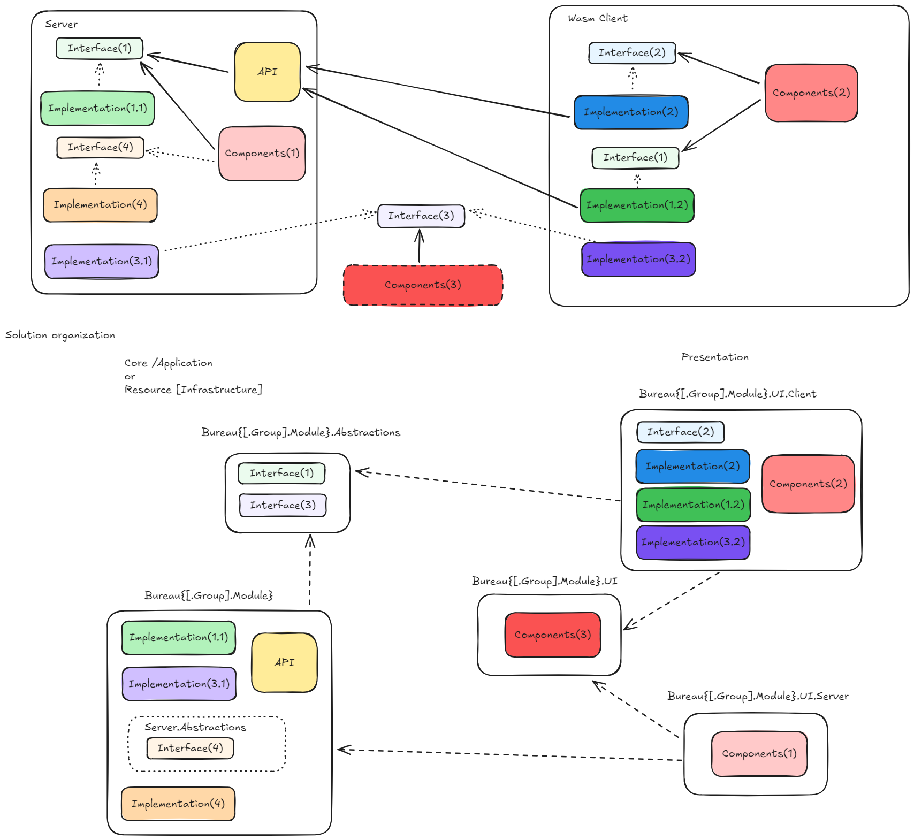

## Project structure
Whatever is in this solution it follows this namining convention
All project names start with `Bureau` 
followed by module's group name, if applicable, and module name separated by dot, e.g. `Bureau.Google.Calendar`

### Solution, Projects, Namespaces

| Namespace | Holds | Project (ideally) | Internal/public (ideally) |
|-|-|-|
| `Bureau{[.Group].Module}.Configurations` | _Implementation(1.1)_ | Bureau\{[.Group].Module\} | public |
| `Bureau{[.Group].Module}.Configurations` | _Implementation(1.2)_ | Bureau\{[.Group].Module\}.UI.Client | public |
| `Bureau{[.Group].Module}.Constants` | _Interface(1)_ | Bureau\{[.Group].Module\}.Abstractions | public |
| `Bureau{[.Group].Module}.Data` | _Interface(1)_ and _Implementation(1.1)_ | Bureau\{[.Group].Module\} | internal |
| `Bureau{[.Group].Module}.Extensions` | _Interface(1)_ and _Implementation(1.1)_ | Bureau\{[.Group].Module\}.Abstractions   Bureau\{[.Group].Module\} | public   internal |
| `Bureau{[.Group].Module}.Factories` | _Interface(1)_ and _Implementation(1.1)_ | Bureau\{[.Group].Module\}.Abstractions   Bureau\{[.Group].Module\} | public   internal |
| `Bureau{[.Group].Module}.Managers` | _Interface(1)_ and _Interface(3)_ | Bureau\{[.Group].Module\}.Abstractions | public |
| `Bureau{[.Group].Module}.Managers` | _Interface(4)_ | Bureau\{[.Group].Module\} Folders: Server.Abstractions | public |
| `Bureau{[.Group].Module}.Managers` | _Implementation(1.1)_, _Implementation(3.1)_ and _Implementation(4)_ | Bureau\{[.Group].Module\} | public |
| `Bureau{[.Group].Module}.Managers` | _Implementation(1.2)_, _Interface(2)_,_Implementation(2)_ and _Implementation(3.2)_ | Bureau\{[.Group].Module\}.UI.Client | public |
| `Bureau{[.Group].Module}.Mappers` | _Interface(1)_ and _Implementation(1.1)_ | Bureau\{[.Group].Module\} | public |
| `Bureau{[.Group].Module}.Middleware` | _Interface(1)_ and _Implementation(1.1)_ | Bureau\{[.Group].Module\} | internal |
| `Bureau{[.Group].Module}.Models` | _Interface(1)_ and _Implementation(1.1)_ | Bureau\{[.Group].Module\}.Abstractions   Bureau\{[.Group].Module\} | public   internal |
| `Bureau{[.Group].Module}.Providers` | _Interface(1)_ and _Interface(3)_ | Bureau\{[.Group].Module\}.Abstractions | public |
| `Bureau{[.Group].Module}.Providers` | _Interface(4)_ | Bureau\{[.Group].Module\} Folders: Server.Abstractions | public |
| `Bureau{[.Group].Module}.Providers` | _Implementation(1.1)_, _Implementation(3.1)_ and _Implementation(4)_ | Bureau\{[.Group].Module\} | public |
| `Bureau{[.Group].Module}.Providers` | _Implementation(1.2)_, _Interface(2)_,_Implementation(2)_ and _Implementation(3.2)_ | Bureau\{[.Group].Module\}.UI.Client | public |
| `Bureau{[.Group].Module}.Repositories` | _Interface(1)_ and _Implementation(1.1)_ | Bureau\{[.Group].Module\} | internal |
| `Bureau{[.Group].Module}.Services` | _Interface(1)_ and _Implementation(1.1)_ | Bureau\{[.Group].Module\} | internal |
| `Bureau{[.Group].Module}.API` | _API_, e.g. controllers | Bureau\{[.Group].Module\} | public |
| `Bureau{[.Group].Module}.UI.Components` |  _Components(3)_ | Bureau\{[.Group].Module\}.UI | public |
| `Bureau{[.Group].Module}.UI.Server.Components` |  _Components(1)_ | Bureau\{[.Group].Module\}.UI.Server | public |
| `Bureau{[.Group].Module}.UI.Client.Components` |  _Components(2)_ | Bureau\{[.Group].Module\}.UI.Client | public |

**Components in `.Components`,`.Components.Server` or `.Components.Client` are further organized by groups or individuals component**

#### Important points
- Interfaces and implementation use same namespace but can be in different projects. 
- if Interfaces are in same project then they are segregated in folder `Abstractions`.
- if Interfaces are in different project then that project name end with `.Abstractions`, e.g. `Bureau.Identity.Abstractions`, holding all interfaces from Identity module

## Private fields or properties
Should be in camel-case and start with "_" and , e.g. _email, _veryCoolVariable